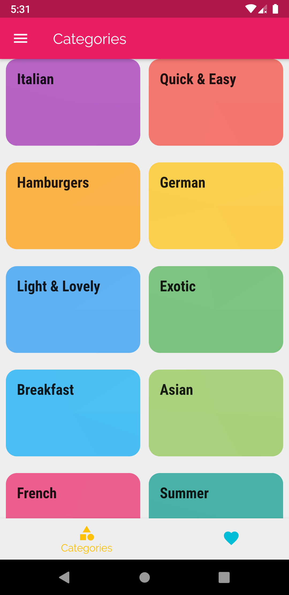
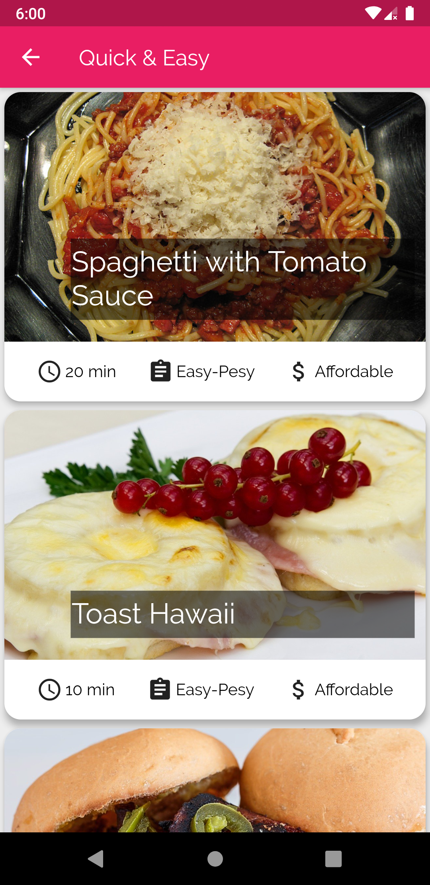
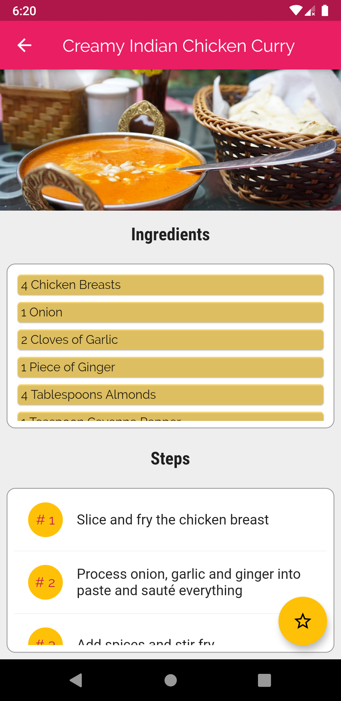
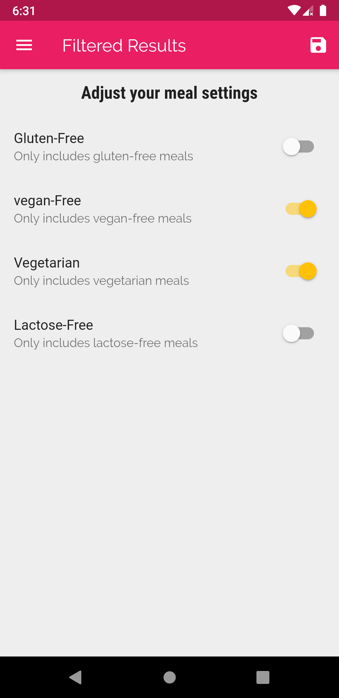
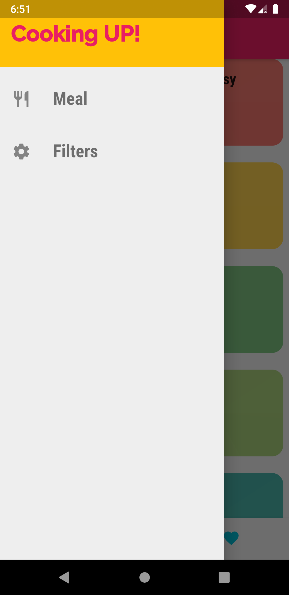
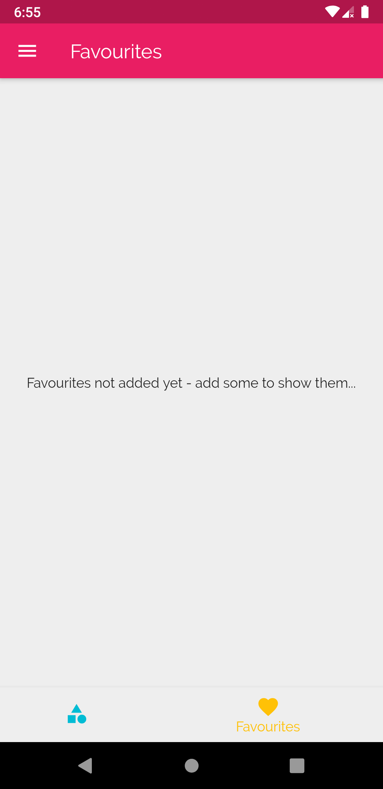
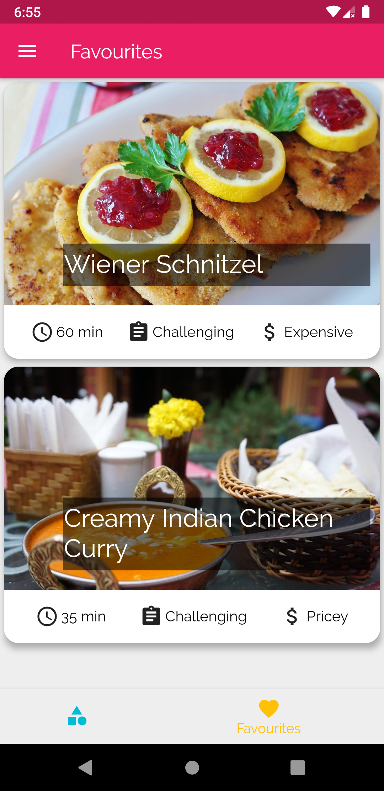

# Meals App

This is a simple flutter application on various meals and their cooking methods.

Here the meal has the following properties:
- A list of categories in which it belongs
- A list of ingredients
- A list of steps
- duration
- complexity(or difficulty)
- affordability
- whether it has gluten
- whether it has lactose
- whether it is vegetarian
- whether it is vegan

## Categories Screen

The categories screen is the home screen of app.(Means on opening the app this screen is first seen.) The categories screen contains a general distribution of categories of types of meals.

## Category Meals Screen

The category meals screen has a list of meals belonging to that category. The title of the screen is the name of the category. The components of a single item are:
- The image of the meal(The image is taken from online resources).
- The name of the meal.
- A bottom row with statistics about the meal. The first item from left is the time taken to make the meal; the second item is the level of making the meal; the third item is the affordability of meal.

Here, the <b>time is in minutes</b>, there are three levels of <b>difficulty : Simple(easy-peasy), challenging, and hard</b>; there are three levels of <b>affordability : Affordable, Pricey and Luxurious(or expensive)</b>.

## Meals Screen

The meals screen gives the actual details of the meal. 
- The title of the screen is the meal's name. 
- Below is an image of a meal and then a list of ingredient items and then a list of steps to make the meal. 
- The floating action button in the bottom right corner favorites the meal and is shown differently in the favorites screen.
  
## Filters Screen

The filter's screen contains the four types in which all the meals will be filtered. Means, as shown in the figure, on saving the results now only meals which are 'vegan-free' and 'vegetarian' will be shown. To save the filter changes tap on the save button on the top left corner.

## App Drawer

The app drawer provides a way to the Categories Screen and the Filters Screen.
- The meal button will take to the Categories Screen.
- Filters button will take to the Filters Screen.
  
## Favourites Screen

  

    
    
  

The favorites screen can navigate through the bottom navigation bar in the Categories Screen. If none of the items are favorited then, it is shown as in the first Figure. If items are favorited, then it is shown as in the second Figure, a list of favorited meal items.

## Future Improvements

These are further improvements in the app.
- The meals and categories data is within the app,i.e, on a file name <i>dummydata.dart</i>. It is not handled online or on a database.
- There is no state management. All the data is passed through the classic method of passing through constructors.
